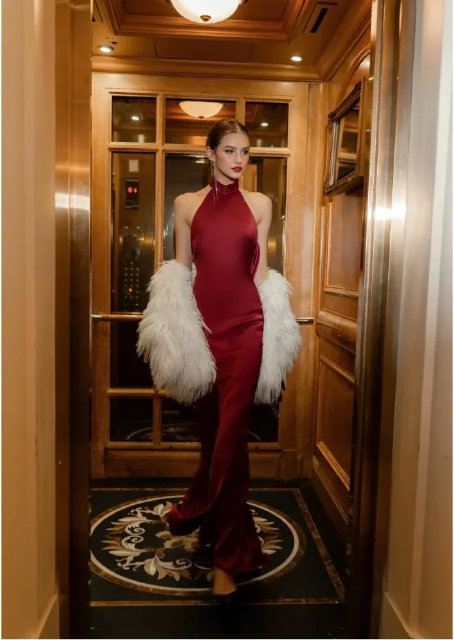
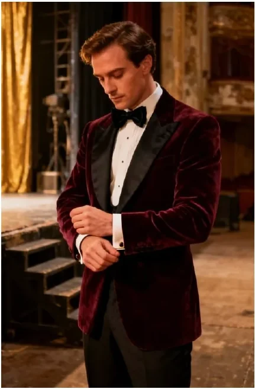

# FIX: background architecture + photo gallery

Skaityk kartu su `CURSOR_HANDOFF.md` ir `CLAUDE_CODE_BRIEF.md`. Šis dokumentas pakeičia
ankstesnę foną-per-sekcijas strategiją nauja, patikimesne architektūra, ir taiso galerijos
layout'ą.

## Kas buvo negerai (diagnozė iš screenshot'ų)

1. **Fonas trūkinėja tarp sekcijų.** Mobile screenshot'e tarp hero antraštės ir „RENGINIO
   PROGRAMA" matosi vientisas tamsus plotas be uždangos tekstūros — tai reiškia, kad intro
   tekstas + CTA mygtukas atsidūrė HTML sekcijoje, kuriai neprisegtas joks `background-image`
   (jie priklauso `bg_1_hero` diapazonui y 0–1900 pagal dizainą, bet turbūt buvo išskirti į
   atskirą `<section>` be fono).
2. **Dekoras (žibintai, varlytė, žiedai, kamera) dingsta mobile'e.** Dalinai tai buvo
   suplanuota (brief'as sakė palikti tik 1-2 elementus per sekciją mobile'e), bet spėju, kad
   realiai dingo daugiau, nei planuota — arba dėl per plataus `display:none` selektoriaus,
   arba dėl to, kad rem-konversija (praeitas fix'as) nebuvo pritaikyta dekorui, ir jis liko
   fiksuotais px, todėl tiesiog nebematomas ekrane.
3. **Galerija prasideda 2 nuotraukom per eilę.** Dizaine pirma nuotrauka (raudona suknelė,
   `photo_01`) yra viena, per visą plotį, PRIEŠ prasidedant 2-3 nuotraukų tinkleliui. Dabar
   `photo_01` pateko į tą patį grid'ą kaip visos kitos.

## Kodėl NE bg_full_single.webp visam puslapiui

Supratau, kodėl norisi vieno vientiso fono — sekcijų siūlės akivaizdžiai blogos. Bet vienas
9048px aukščio paveikslas, ištemptas per visą puslapį, techniškai neišspręs to paties dalyko
mobile'e: mobile turinys (dėl teksto laužymosi) bus **proporcingai daug aukštesnis** santykyje
su pločiu nei desktop 1920:9048. Jei tą patį paveikslą tiesiog ištemptum per visą puslapio
aukštį, uždangos raukšlės mobile'e atrodys ištemptos/iškraipytos — tas pats disproporcijos
efektas, kurio jau kartą taisėme su tekstu.

## Naujas sprendimas: begalinė uždangos tekstūra + fiksuotas hero fonas

Vietoj 4 sekcijų arba 1 milžiniško paveikslo — **begalinis, besikartojantis (tileable)
uždangos audinys**, kuris vizualiai neturi jokios "pradžios" ar "pabaigos", tad puikiai
veikia bet kokio aukščio puslapyje, bet kokiame breakpoint'e.

Nauji/pakeisti failai `assets/bg_slices/`:

- **`curtain_tile.webp`** (1920×360, ~9KB) — vien uždangos audinys, be spotlight, be teksto,
  be dekoro. Patikrinta: kartojasi vertikaliai be matomos siūlės.
- **`bg_1_hero.webp`** — nepakeistas, lieka. Vienintelis fonas, kuriame įkeptas raudonas
  spotlight švytėjimas. Naudoti TIK hero sekcijai (viskas nuo antraštės iki CTA mygtuko
  imtinai — originalus y 0–1900 diapazonas).
- **`bg_2_program.webp`, `bg_3_dresscode.webp`, `bg_4_photos.webp`, `bg_full_single.webp`** —
  **nebenaudoti**. Palikti zip'e istorijai, bet CSS jų neturi referuoti.

### CSS realizacija

```css
body {
  background-image: url('assets/bg_slices/curtain_tile.webp');
  background-repeat: repeat-y;
  background-size: 100% auto;
}

.hero-section {  /* arba koks tavo section'o class'as apima title→CTA */
  background-image: url('assets/bg_slices/bg_1_hero.webp');
  background-repeat: no-repeat;
  background-size: cover;
  background-position: top center;
}
```

Visos kitos sekcijos (programa, dress code, galerija) **jokio atskiro background-image
nereikia** — jos tiesiog rodo `body`'io besikartojantį audinį per savo skaidrų foną. Tai
išsprendžia siūlių problemą struktūriškai: nebėra kelių atskirų fonų, kuriuos reikia tiksliai
suderinti su sekcijų aukščiais — yra vienas begalinis fonas, kuris visada dengia viską.

### Apatiniai švytėjimai (buvę „sviesa" prie žibintų)

Bandžiau juos ištraukti kaip atskirus overlay'us — nepavyko: Photoshop'e jie naudoja blend
mode, kuris veikia tik su uždanga apačioje, izoliuotai virsta tiesiog tamsia dėme. Vietoj
paveikslėlio — CSS glow ant `light_fixture` dekoro elemento wrapper'io:

```css
.light-fixture-wrap {
  position: relative;
}
.light-fixture-wrap::before {
  content: '';
  position: absolute;
  inset: -40%;
  background: radial-gradient(circle, rgba(230,160,90,0.35), transparent 70%);
  z-index: -1;
}
```

Šis variantas realiai geresnis už paveikslėlį — jis automatiškai laikosi prie
`light_fixture` elemento bet kuriame breakpoint'e, nereikia atskirai pozicionuoti pagal
scroll koordinatę.

## Dekoro matomumas mobile'e — patikrink, nefiksuok aklai

Prieš darant naujus pakeitimus, patikrink esamą mobile CSS: ar `display:none` taisyklė
netaikoma per plačiai (pvz. visai `.decor` klasei vietoj konkrečių elementų). Pagal brief'ą
mobile'e turi likti matomi: mikrofonas (hero), viena kino juostelė, varlytė, viena žvaigždė.
Likusius (žiedus, kamerą, clapperboard'ą, antrą-trečią kino juostelę) — slėpti sąmoningai,
ne per klaidą. Ir įsitikink, kad likę matomi elementai pozicionuoti `rem`, ne fiksuotais px
(žr. `CURSOR_HANDOFF.md` #1) — kitaip jie liks matomi kode, bet realiai išstumti už matomos
srities.

## Nuotraukų galerija

`photos_manifest.json` atnaujintas — kiekvienas įrašas dabar turi `featured_full_width`
lauką. `photo_01` = `true`, visos kitos = `false`.

HTML/CSS struktūra:

```html

<div class="photo-grid">
  
  <!-- photo_03 … photo_14, sekant photos_manifest.json row grupavimą -->
</div>
```

```css
.photo-featured {
  width: 100%;
  display: block;
}
.photo-grid {
  display: grid;
  grid-template-columns: repeat(2, 1fr); /* desktop gali būti tikslesnis pagal row */
  gap: 1rem;
}
```

Tiek mobile, tiek desktop: `photo_01` visada pirmas, visada per visą plotį, visada VIENAS,
prieš prasidedant tinkleliui apačioje.

## Visų failų formatas

Visi `cutouts/*.png` konvertuoti į `.webp` (su alfa kanalu, be kokybės nuostolio šiam
turiniui). `manifest.json` atnaujintas — visos `file` reikšmės dabar rodo į `.webp`.
Patikrink, kad kode neliktų nuorodų į `.png` — jų `assets/` aplanke daugiau nėra.

---

Toliau vartotojas atsiųs tikslius screenshot'us, kaip turi atrodyti kiekviena puslapio
dalis, mobile ir desktop — tai galutinis vizualinis etalonas šitam etapui, papildantis
`REFERENCE_desktop_1920.jpg` (kuris lieka teisingas desktop etalonas, tik dabar be sekcijų
foną liečiančios dalies — ta dalis keičiasi pagal šį dokumentą).
